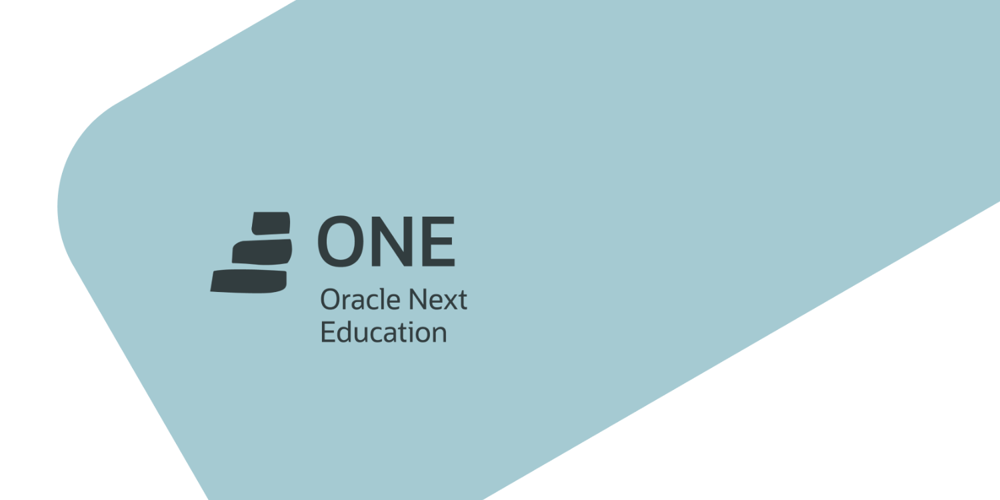

<h1 align="center">
  AlumniONE BR
</h1>

Alumni ONE é a comunidade de ex alunos do programa ONE - Oracle Next Education

### Linguagem utilizada:
- SQL

### Softwares utilizados:
- MySQL Server
- MySQL Workbench

### Observação: Este curso é prático, siga a sequência apartir do 1° commit para melhores resultados.
