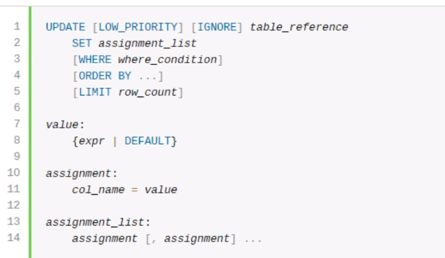
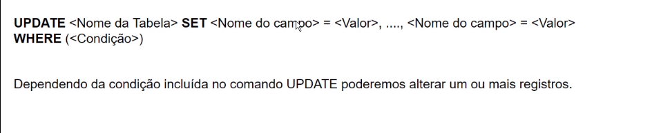
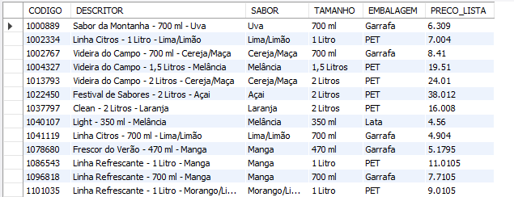
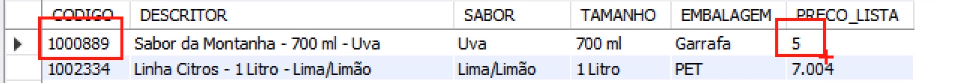
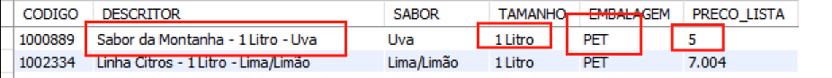

## UPDATE
O comando UPDATE é aquele que modifica dados dentro de uma tabela. 

#### Sintaxe do comando:
<br>
<br>

<br>
<br>

Esteja na base vendas_sucos
```
USE vendas_sucos;
```

Vamos verificar a lista de produtos.
```
SELECT * FROM produtos;
```
<br>
<br>

Vamos alterar o preço de lista de um dos produtos. Para isso digite:
```
UPDATE produtos SET PRECO_LISTA = 5 WHERE CODIGO = '1000889';
```
<br>
Executando o select novamente veja que o campo mudou seu valor:

```
SELECT * FROM produtos;
```
<br>
<br>

Podemos alterar outros dados da tabela:<br>
Vamos modificar o nosso produto '1000889' de GARRAFA para PET. Temos que modificar outros valores também pois PET é acima de 1L.

```
UPDATE produtos SET EMBALAGEM = 'PET', TAMANHO = '1 Litro', DESCRITOR =

'Sabor da Montanha - 1 Litro - Uva' WHERE CODIGO = '1000889';
```

Executando o select novamente veja que os campos mudaram seus valores:

```
SELECT * FROM produtos;
```
<br>
<br>
Também podemos alterar o preço de lista baseado no mesmo campo que será alterado, isso modificará o valor em 10% de todos os sabores que são maracujá . Digite e execute:

```
UPDATE produtos SET PRECO_LISTA = PRECO_LISTA * 1.10 WHERE SABOR = 'Maracujá';
```
<br>

Atualizando o endereço do cliente com cpf 19290992743 para R. Jorge Emílio 23 o bairro para Santo Amaro, a cidade para São Paulo, o estado para SP e o CEP para 8833223.

```
UPDATE CLIENTES
SET ENDERECO = 'R. Jorge Emilio 23',
BAIRRO = 'Santo Amaro',
CIDADE = 'São Paulo',
ESTADO = 'SP',
CEP = '8833223'
WHERE CPF = '19290992743 '
```