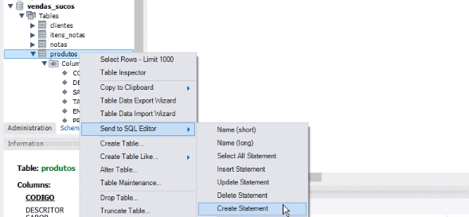
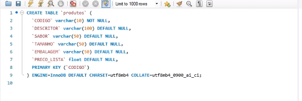
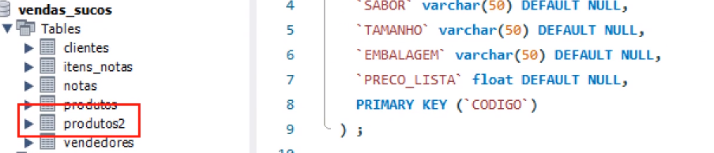
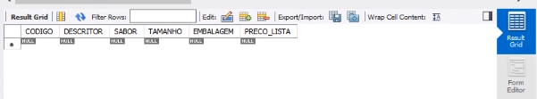
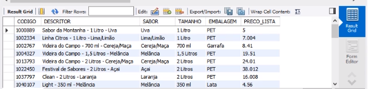
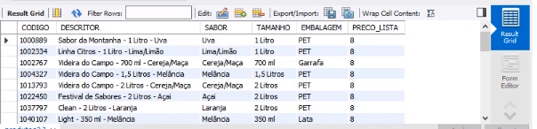

## UPDATE e DELETE
Os comandos UPDATE e DELETE podem ser executados sobre a tabela inteira. Vamos então criar uma tabela de forma temporária para depois alterá-la e apagá-la.<br>

Botão direito do mouse sobre a tabela de produtos.<br>
<br>
Ao fazer isso, ele vai escrever o comando de SQL para criar uma tabela igual aquela tabela que já existe.<br>
<br>

Vamos renomear essa tabela para produtos2, pode tirar o ENGINE e rodar esse script:

```
CREATE TABLE `produtos2` (

  `CODIGO` varchar(10) NOT NULL,

  `DESCRITOR` varchar(100) DEFAULT NULL,

  `SABOR` varchar(50) DEFAULT NULL,

  `TAMANHO` varchar(50) DEFAULT NULL,

  `EMBALAGEM` varchar(50) DEFAULT NULL,

  `PRECO_LISTA` float DEFAULT NULL,

  PRIMARY KEY (`CODIGO`)

) ;
```
Veja que ele criará a tabela produtos2:<br>
<br>

Executando o select veremos que ela está vazia:
```
SELECT * FROM produtos2
```
<br>

Vamos inserir os dados da tabela de 'produtos' para a nossa nova tabela 'produtos2':<br>
```
INSERT INTO produtos2 SELECT * FROM produtos
```
Rodando o select novamente, teremos dados dentro da tabela produtos2:
```
SELECT * FROM produtos2
```
<br>

Lembre-se que podemos alterar todas as linhas num determinado campo, por exemplo:
```
UPDATE produtos2 SET preco_lista = 8;
```
Note que nesse comando aqui update, eu não coloquei um WHERE. Isso significa que ele vai fazer essa alteração em toda a tabela.
```
SELECT * FROM produtos2
```
<br>

O comando abaixo apaga todos os registros da tabela. Digite o comando abaixo e execute para apagar os dados da tabela:
```
DELETE FROM produtos2;
```
```
SELECT * FROM produtos2
```
<br>

Se atente aos DELETES e UPDATES, delete/update from sem o WHERE, você vai perder/alterar tudo que você tem dentro da sua tabela e não tem como recuperar.
<br>
<br>

Vamos apagar todos os dados da tabela NOTAS e ITENS_NOTAS.<br>

```
DELETE FROM ITENS_NOTAS;
DELETE FROM NOTAS;

```
Observação: Por causa da chave estrangeira devemos apagar, primeiro, a tabela de ITENS_NOTAS para depois apagar a tabela de NOTAS.