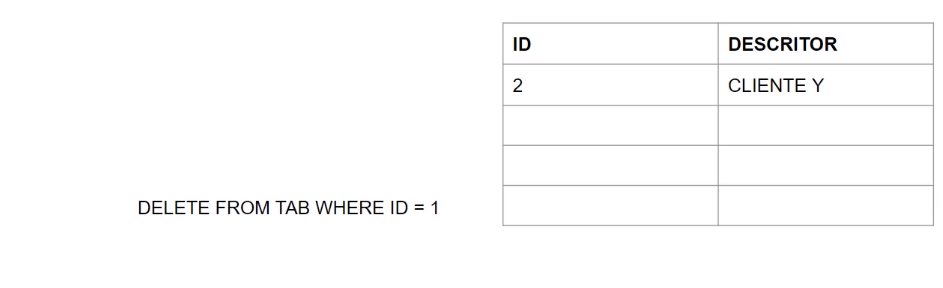

## AUTO INCREMENTO

É um número que será automaticamente incrementado seguindo uma sequencia.<br>
<br>
<br><br>
Vamos supor que eu tenho uma tabela com um campo ID e um campo DESCRITOR, e esse campo ID tem essa propriedade de auto incremento.
Quando eu faço a inclusão de um novo registro, automaticamente esse ID vai crescendo, respeitando uma sequência numérica.<br>
<br>

A incrementação desses IDs são automáticos, não precisamos dizer qual será o numero, mas para outras ações como um Delete, um Select, um Update, eu posso me referenciar na cláusula WHERE aquele campo ID.<br>
Se eu quiser dar um Delete no ID = 1 ele vai sumir.<br>
<br>

Só vai ficar o ID 2, e então se eu der um novo Insert, automaticamente ele continua fazendo um incremento sequencial, criando o ID 3.<br>
<br><br>

O campo do tipo auto incremento cria uma sequência numérica de números inteiros em um campo. Para definir este campo precisamos configurá-lo na criação da tabela. Logo digite o comando abaixo e execute:<br>
```
CREATE TABLE TAB_IDENTITY (ID INT AUTO_INCREMENT, DESCRITOR VARCHAR(20), PRIMARY KEY(ID));
```
Para inserir um registro não precisamos nos referenciar ao campo auto incremento no comando INSERT. Digite e execute:<br>
```
INSERT INTO TAB_IDENTITY (DESCRITOR) VALUES ('CLIENTE1');
```
Verifique o conteúdo da tabela. Digite e execute:
```
SELECT * FROM TAB_IDENTITY;
```
<br>
Note que ele colocou o número 1 para o ID automaticamente, eu não mencionei nada do ID dentro do comando Insert.<br><br>

Abaixo vemos diversas formas de inclusão de novos registros. Digite e execute:
```
INSERT INTO TAB_IDENTITY (DESCRITOR) VALUES ('CLIENTE2');

INSERT INTO TAB_IDENTITY (DESCRITOR) VALUES ('CLIENTE3');

INSERT INTO TAB_IDENTITY (ID, DESCRITOR) VALUES (NULL, 'CLIENTE4');
```
Mencionamos o ID, como Null, e isso faz o mesmo efeito de eu não mencionar o ID.<br>

Verifique o conteúdo da tabela. Digite e execute:
```
SELECT * FROM TAB_IDENTITY;
```
<br><br>

Ao apagar um registro não interrompemos a sequência do contador. veja também que, se quisermos manter o campo auto incremento no comando INSERT temos que referencia-lo com null para não interromper a sequência. Digite e execute:
```
DELETE FROM TAB_IDENTITY WHERE ID = 2;
```
```
INSERT INTO TAB_IDENTITY (ID, DESCRITOR) VALUES (NULL, 'CLIENTE5');
```
```
SELECT * FROM TAB_IDENTITY;
```
<br><br>

Caso a gente force um valor para o campo auto incremento a sequência será re- atualizada. Digite e execute:
```
INSERT INTO TAB_IDENTITY (ID, DESCRITOR) VALUES (100, 'CLIENTE5');
```
```
DELETE FROM TAB_IDENTITY WHERE ID = 5;
```
```
INSERT INTO TAB_IDENTITY (ID, DESCRITOR) VALUES (NULL, 'CLIENTE6');
```
```
SELECT * FROM TAB_IDENTITY;
```
<br><br>