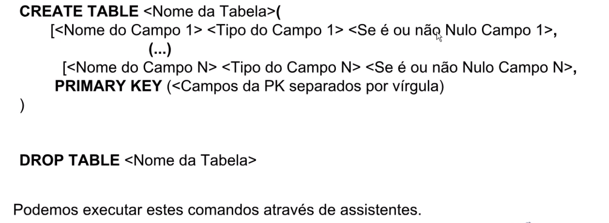

## Criando uma tabela
#### Sintaxe do comando


<br>

### Selecione o banco para criar uma tabela:
```
USE vendas_sucos;
```
<br>

### Criando as tabelas produtos e vendedores: 
```
CREATE TABLE PRODUTOS
(CODIGO VARCHAR(10) NOT NULL,
DESCRITOR VARCHAR(100) NULL,
SABOR VARCHAR(50) NULL,
TAMANHO VARCHAR(50) NULL,
EMBALAGEM VARCHAR(50) NULL,
PRECO_LISTA FLOAT NULL,
PRIMARY KEY (CODIGO));
```
```
CREATE TABLE VENDEDORES
(MATRICULA VARCHAR(5) NOT NULL,
NOME VARCHAR(100) NULL,
BAIRRO VARCHAR(50) NULL,
COMISSAO FLOAT NULL,
DATA_ADIMISSAO DATE NULL,
FERIAS BIT(1) NULL,
PRIMARY KEY (MATRICULA));
```
### Alterar dados: nesse caso renomeando um nome
```
ALTER TABLE VENDEDORES RENAME COLUMN DATA_ADIMISSAO TO DATA_ADMISSAO;
```