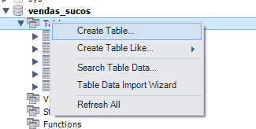
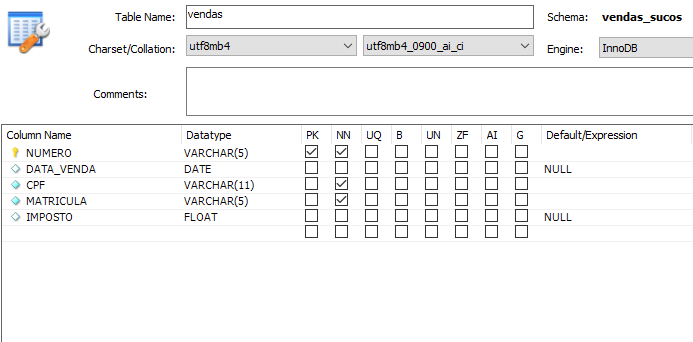
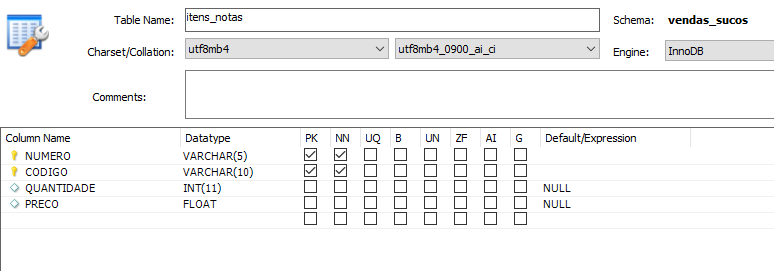

## Criando uma tabela de vendas e itens pelo assistente do workbench

### Criando tabela de vendas
Botão da direita do mouse sobre a pasta Tables do banco vendas_sucos e escolha a opção mostrada abaixo:

No grid de criação da tabela digite:  

Salve com o nome VENDAS.

 

### Criando tabela de itens notas

Botão da direita do mouse sobre a pasta Tables do banco vendas_sucos e escolha a opção mostrada abaixo:

No grid de criação da tabela digite:

Salve com o nome ITENS_NOTAS.

