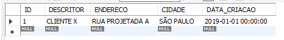
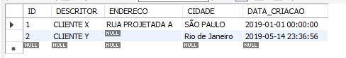

## PADRÕES PARA OS CAMPOS


Podemos definir padrões para os campos. Com isto um campo pode ter um valor default caso não seja referenciado no comando INSERT. Digite e execute:<br>

```
CREATE TABLE TAB_PADRAO

(ID INT AUTO_INCREMENT,

DESCRITOR VARCHAR(20),

ENDERECO VARCHAR(100) NULL,

CIDADE VARCHAR(50) DEFAULT 'Rio de Janeiro',

DATA_CRIACAO TIMESTAMP DEFAULT CURRENT_TIMESTAMP(),

PRIMARY KEY(ID));
```
Lembrando:<br>
Timestamp nos fornece a data com hora, minuto e segundo;<br>
A função Current Timestamp me dá a data e hora do computador.<br><br>
Padrões foram criados para o campo ENDERECO, CIDADE e DATA_CRIACAO. Digite e execute:

```
INSERT INTO TAB_PADRAO (DESCRITOR, ENDERECO, CIDADE, DATA_CRIACAO)

VALUES ('CLIENTE X', 'RUA PROJETADA A', 'SÃO PAULO', '2019-01-01');
```
```
SELECT * FROM TAB_PADRAO;
```
<br>
Aqui o comando INSERT funciona normalmente porque todos os campos foram referenciados.<br><br>
Vamos repetir o comando INSERT, mas agora usando somente os campos que não possuem padrões. Digite e execute:

```
INSERT INTO TAB_PADRAO (DESCRITOR) VALUES ('CLIENTE Y');
```
```
SELECT * FROM TAB_PADRAO;
```
<br>
Note que os campos que não foram referenciados no comando INSERT os seus valores padrões foram incluídos na tabela. Endereço, cidade e data da criação, possuem um valor padrão.<br>
Então caso não seja mencionado no Insert valores para estes três campos, uma SQL vai colocar na tabela os valores padronizados que foram colocados durante a criação da tabela.<br><br>

Detalhe sobre Timestamp Default Current_Timestamp:<br>
Registra na tabela em que momento aquele campo foi alterado ou inserido; <br>Isso ajuda para fazer manutenção de sistema, se precisar saber quais foram os últimos registros colocados na base, então, normalmente, quando o pessoal desenvolve um sistema transacional, todas as tabelas têm um campo lá perdido, porque eu não preciso mencionar ele no Insert. Então tem um campo lá que tem um nome padronizado que é do tipo Timestamp e tem como Default o Current Timestamp.
