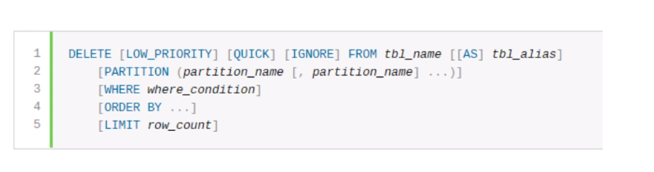
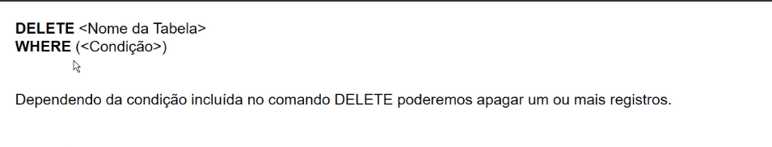
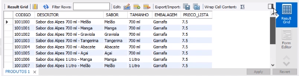
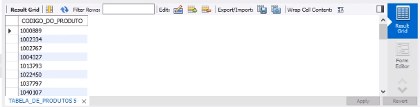
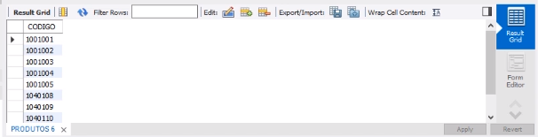
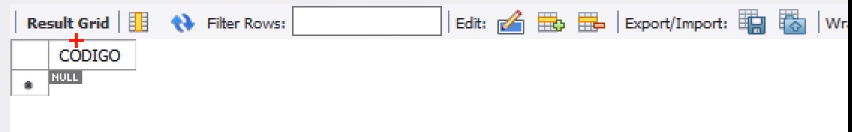

## DELETE

Excluir dados de uma tabela do banco de dados.

<br>

#### Sintaxe do comando



<br>
Primeiramente verifique se está na base vendas_sucos:

```
USE vendas_sucos;
```
Vamos incluir novos registros que depois serão excluídos. Digite e execute:
```
  INSERT INTO PRODUTOS (CODIGO,DESCRITOR,SABOR,TAMANHO,EMBALAGEM,PRECO_LISTA)

     VALUES ('1001001','Sabor dos Alpes 700 ml - Manga','Manga','700 ml','Garrafa',7.50),

         ('1001000','Sabor dos Alpes 700 ml - Melão','Melão','700 ml','Garrafa',7.50),

         ('1001002','Sabor dos Alpes 700 ml - Graviola','Graviola','700 ml','Garrafa',7.50),

         ('1001003','Sabor dos Alpes 700 ml - Tangerina','Tangerina','700 ml','Garrafa',7.50),

         ('1001004','Sabor dos Alpes 700 ml - Abacate','Abacate','700 ml','Garrafa',7.50),

         ('1001005','Sabor dos Alpes 700 ml - Açai','Açai','700 ml','Garrafa',7.50),

         ('1001006','Sabor dos Alpes 1 Litro - Manga','Manga','1 Litro','Garrafa',7.50),

         ('1001007','Sabor dos Alpes 1 Litro - Melão','Melão','1 Litro','Garrafa',7.50),

         ('1001008','Sabor dos Alpes 1 Litro - Graviola','Graviola','1 Litro','Garrafa',7.50),

         ('1001009','Sabor dos Alpes 1 Litro - Tangerina','Tangerina','1 Litro','Garrafa',7.50),

         ('1001010','Sabor dos Alpes 1 Litro - Abacate','Abacate','1 Litro','Garrafa',7.50),

         ('1001011','Sabor dos Alpes 1 Litro - Açai','Açai','1 Litro','Garrafa',7.50);
```

Mostra todos os produtos que tenham nome/DISCRITOR 'Sabor dos Alpes':
```
SELECT * FROM PRODUTOS WHERE SUBSTRING(DISCRITOR, 1, 15) = 'Sabor dos Alpes';
```


Para apagar um registro apenas. Digite e execute:
```
DELETE FROM PRODUTOS WHERE CODIGO = '1001000';
```
Podemos aplicar um filtro para selecionar mais dados a serem excluidos. Nesse caso vamos deletar todos os produtos de 1L que tenham o nome/DISCRITOR 'Sabor dos Alpes'. Digite e execute:
```
DELETE FROM PRODUTOS WHERE TAMANHO = '1 Litro' AND SUBSTRING(DESCRITOR,1,15) = 'Sabor dos Alpes';
```
<br>

Podemos fazer exclusões usando como base o conteudo de uma outra tabelas

Selecionando os produtos da base sucos_vendas:
```
SELECT codigo_do_produto FROM sucos_vendas.tabela_de_produtos;
```
<br>


Selecionando os produtos da base vendas_sucos, utilizando uma subquery para verificar os produtos que existem na tabela produtos de (vendas_sucos) mas não existem na tabela_de_produtos do (sucos_vendas):
```
SELECT codigo FROM produtos WHERE codigo NOT IN 
(SELECT codigo_do_produto FROM sucos_vendas.tabela_de_produtos);
```
<br>
Digamos que isso seja uma sincronização de dados, queremos que a nossa tabela de produtos de vendas_sucos seja IGUAL a tabela de produto de sucos_vendas.

<br>


Esse nosso comando para deletar digamos que ele está sincronizando as duas tabelas, ele está apagando quem tem na tabela do meu banco e quem não tem na tabela, digamos modelo, ou padrão, que eu estou usando.<br>
Digite e execute:
```
DELETE FROM PRODUTOS WHERE CODIGO NOT IN ( SELECT CODIGO_DO_PRODUTO FROM SUCOS_VENDAS.TABELA_DE_PRODUTOS);
```
Execute o select novamente:
```
SELECT codigo FROM produtos WHERE codigo NOT IN 
(SELECT codigo_do_produto FROM sucos_vendas.tabela_de_produtos);
```
Retornará vazio, porque agora as duas tabelas estão sincronizadas com os valores iguais:
<br>

<br>
Vamos excluir as notas fiscais (Apenas o cabeçalho) cujos clientes tenham a idade menor ou igual a 18 anos.<br>
Digite e execute:

```
SELECT A.NUMERO FROM NOTAS A
INNER JOIN CLIENTES B ON A.CPF = B.CPF
WHERE B.IDADE <= 18
```

Digite e execute:
```
DELETE A FROM NOTAS A
INNER JOIN CLIENTES B ON A.CPF = B.CPF
WHERE B.IDADE <= 18
```