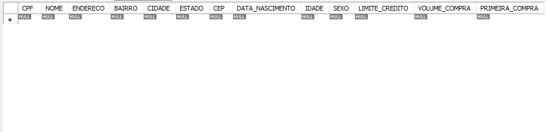
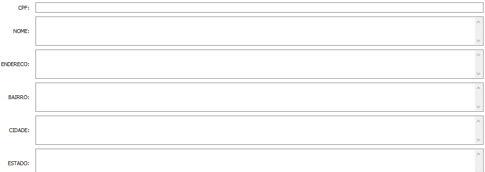
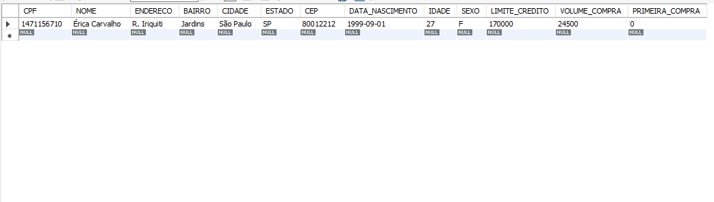
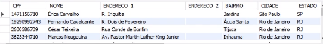
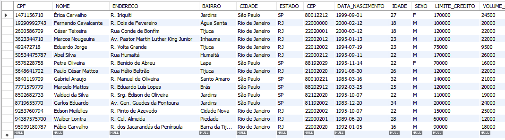

# Incluindo através do assistente

Mostraremos como incluir dados na tabela de cliente. Digite e execute:
```
SELECT * FROM clientes;
```


<br>


Ao lado temos o botão Form Editor:


<br>

Teremos uma caixa de diálogo para editar a tabela de Clientes.

<br>

Inclua um novo cliente:
```
CPF: 1471156710;
NOME: Érica Carvalho;
ENDERECO: R. Iriquiti;
BAIRRO: Jardins;
CIDADE: São Paulo;
ESTADO: SP;
CEP: 80012212;
DATA_NASCIMENTO: 1999-09-01;
IDADE: 27;
SEXO: F;
LIMITE_CREDITO: 170000;
VOLUME_COMPRA: 24500;
PRIMEIRA_COMPRA: 0;
```
Confirme a inclusão. O comando será apresentado e confirme a execução.

<br>

Execute a consulta novamente. Digite e execute:
```
SELECT * FROM clientes;
```
<br>

O cliente foi incluido.

<br>

Vamos inserir os dados restantes, mas primeiro vamos ver como está a tabela clientes em sucos_vendas:
```
SELECT * FROM sucos_vendas.tabela_de_clientes;
```
<br>


Vamos incluir os clientes usando como fonte o outro banco de dados(sucos_vendas), lembrando que um cliente já foi incluido via assistente, então coloca-se esse filtro para não duplicar ( WHERE CPF NOT IN (SELECT CPF FROM CLIENTES)) Digite e execute:
```
INSERT INTO CLIENTES

SELECT CPF, NOME, ENDERECO_1 AS ENDERECO, BAIRRO, CIDADE, ESTADO, CEP,

DATA_DE_NASCIMENTO AS DATA_NASCIMENTO, IDADE, SEXO, LIMITE_DE_CREDITO AS LIMITE_CREDITO,

VOLUME_DE_COMPRA AS VOLUME_COMPRA, PRIMEIRA_COMPRA

FROM sucos_vendas.tabela_de_clientes WHERE CPF

NOT IN (SELECT CPF FROM CLIENTES);
```

Teste o conteúdo da tabela de clientes:
 ```
SELECT * FROM CLIENTES;
```
<br>


<br>
<br>

___________________________________________________________________
## Explicação sobre incluir dados de um banco ao outro para não confundir:
Estamos usando o banco vendas_sucos e estamos pegando os dados para popular esse nosso banco de outro banco o sucos_vendas.

Esse select seleciona os dados de clientes da base sucos_vendas
```
SELECT * FROM sucos_vendas.tabela_de_clientes;
```
<br>

Esse select seleciona os dados de clientes da base vendas_sucos
```
SELECT * FROM CLIENTES;
```

<br> 
Então para popular essa nossa base, precisamos olhar como está os campos da sucos_vendas e os campos do vendas_sucos.<br>

Por exemplo: DATA_DE_NASCIMENTO é do sucos_vendas, estamos pegando todos os dados desse campo e inserindo no nosso campo que apelidamos de DATA_NASCIMENTO que é o nome do nosso campo em vendas_sucos.

```
INSERT INTO CLIENTES

SELECT CPF, NOME, ENDERECO_1 AS ENDERECO, BAIRRO, CIDADE, ESTADO, CEP,

DATA_DE_NASCIMENTO AS DATA_NASCIMENTO, IDADE, SEXO, LIMITE_DE_CREDITO AS LIMITE_CREDITO,

VOLUME_DE_COMPRA AS VOLUME_COMPRA, PRIMEIRA_COMPRA

FROM sucos_vendas.tabela_de_clientes WHERE CPF

NOT IN (SELECT CPF FROM CLIENTES);
```


Quando fala-se em origem é o banco que pegamos dados.
Quano fala-se de destino é o banco que está utilizando esses dados.