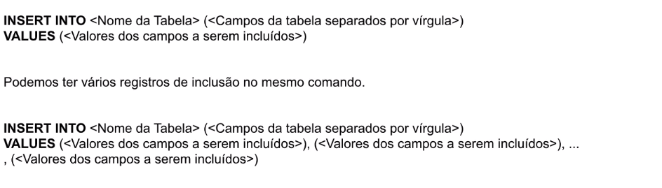
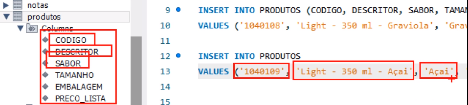

## INSERT
O comando INSERT é aquele que insere dados dentro de uma tabela. 

#### Sintaxe do comando:
<br>

- INSERT + INTO, o nome da tabela, entre parêntesis os campos da tabela.
- VALUES, valores que eu vou inserir dentro da tabela.
- Em values se os campos forem textos eles têm que estar entre aspas simples, se forem números não precisa das aspas.
- Casas decimais sempre com ponto.

<br>

Inserir dados na tabela. Digite e execute:

```
INSERT INTO PRODUTOS (CODIGO, DESCRITOR, SABOR, TAMANHO, EMBALAGEM, PRECO_LISTA)

VALUES ('1040107', 'Light - 350 ml - Melância', 'Melância', '350 ml', 'Lata', 4.56);
```
<br>

Conferir se o produto foi realmente incluido na tabela. Digite e execute:
```
SELECT * FROM PRODUTOS;
```
<br>

O comando sem a lista de campos: 
```
INSERT INTO PRODUTOS 
VALUES ('1040107', 'Light - 350 ml - Melância', 'Melância', '350 ml', 'Lata', 4.56);
```
Você só pode usar quando a ordem dos values respeita a ordem dos campos da tabela.<br>


<br>

Inserir de mais de um registro:
- Precisa separar apenas com vírgula.
- Cada coluna tem que estar igual, correspondente ao mesmo tipo para que eu possa rodar o INSERT com mais de uma linha.
Digite e execute:
```
INSERT INTO PRODUTOS (CODIGO, DESCRITOR, SABOR, TAMANHO, EMBALAGEM, PRECO_LISTA)

VALUES 
('1040110', 'Light - 350 ml - Jaca', 'Jaca', '350 ml', 'Lata', 6.00),
('1040111', 'Light - 350 ml - Manga', 'Manga', '350 ml', 'Lata', 3.50);
```
