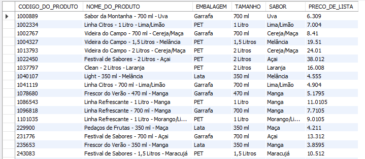
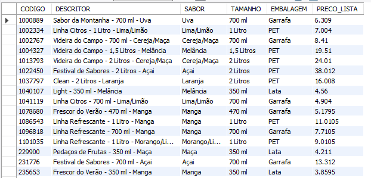

## Incluindo múltiplos registros

<br>

Vamos primeiramente importar um arquivo contendo dados para utilizarmos
Siga os passos abaixo:
1) Crie um database chamado sucos_vendas.

1) Faça Download do arquivo RecuperacaoAmbiente.zip.

2) Descompacte o arquivo.

3) Selecione, na área Navigator, em Administration.

4) Selecione o link Data Import/Restore.

5) Na opção Import From Dump Project Folder escolha o diretório do arquivo descompactado.

6) Selecione Start Import. Aguarde, esse processo é a recuperação da base sucos_vendas.

7) Verifique na base sucos_vendas se as tabelas foram criadas. Em Schemas, de um Refresh.

<br>

### Esse banco restaurado (sucos_vendas) servirá de fonte para colocar dados no banco que estamos trabalhando (vendas_sucos).

<br>

Dentro dele eu posso fazer um SELECT para olhar o conteúdo de uma tabela de um outro banco sem sair do banco que eu estou.
Digite e execute:
```
USE vendas_sucos;

SELECT * FROM sucos_vendas.tabela_de_produtos;
```
<br>

<br>

A consulta, a seguir, mostra a lista de produtos, na tabela tabela_de_produtos, da base sucos_vendas que ainda não foram incluídas na tabela produtos, da base vendas_sucos. 
Digite e execute:
```
SELECT CODIGO_DO_PRODUTO AS CODIGO, NOME_DO_PRODUTO AS DESCRITOR,

EMBALAGEM, TAMANHO, SABOR, PRECO_DE_LISTA AS PRECO_LISTA

FROM sucos_vendas.tabela_de_produtos

WHERE CODIGO_DO_PRODUTO NOT IN (SELECT CODIGO FROM produtos);
```
Demos um ALIAS(apelido) nas colunas. Ou seja, originalmente é um nome, mas eu quero que se chame outro.

<br>
Agora vamos inserir esses produtos que filtramos e que ainda não existem no nosso banco(vendas_sucos).
Digite e execute:

```
INSERT INTO produtos

SELECT CODIGO_DO_PRODUTO AS CODIGO, NOME_DO_PRODUTO AS DESCRITOR,

SABOR, TAMANHO, EMBALAGEM,  PRECO_DE_LISTA AS PRECO_LISTA

FROM sucos_vendas.tabela_de_produtos

WHERE CODIGO_DO_PRODUTO NOT IN (SELECT CODIGO FROM produtos);
```

<br>
Vamos conferir a tabela de produtos. Digite e execute:

```
SELECT * FROM produtos;
```
<br>
