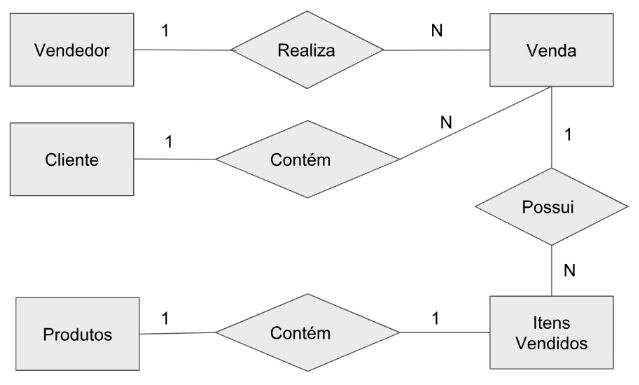
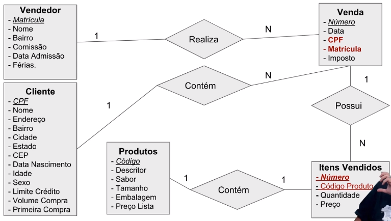
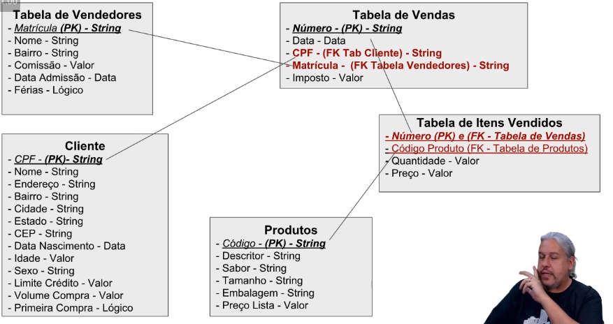

Quando a gente vai projetar um banco de dados a gente tem que conhecer bem o negócio no qual o banco de dados está modelando.

Temos que levar em consideração que a gente precisa,ter um grande entendimento das regras de negócio, conversar, fazer entrevistas, entender com o usuário como é que o seu negócio funciona, e tentar desenhar um banco de dados que modelo o processo da empresa na sua maneira mais fiel e próximo à realidade.

A partir do momento que você tem essas informações, você constrói o que nós chamamos de um diagrama de entidade e relacionamento.

É como se fosse um diagrama que diz como é que cada entidade da sua empresa se relaciona entre si, e nós vamos estabelecer uma cardinalidade entre essas entidades.

Exemplo diagrama de relacionamento:  

Depois desse diagrama de relacionamento a gente estende ele e mostra as suas propriedades:  

Cada entidade de relacionamento ele acaba virando uma ou mais tabelas.

E cada conexão que está contida entre essas entidades, vai virar um relacionamento do banco de dados.

Então, aquele diagrama de entidades que eu criei vai virar tabelas onde eu vou definir como chaves primárias aquilo que não pode se repetir, aquilo que identifica a entidade.

Cada propriedade vai virar um campo da tabela, e aí dependendo da propriedade eu já especifico qual é o seu tipo. E os relacionamentos serão as chaves estrangeiras.

Com esse diagrama de tabelas pronto, a gente parte para construí-lo fisicamente em uma base de dados relacional.

