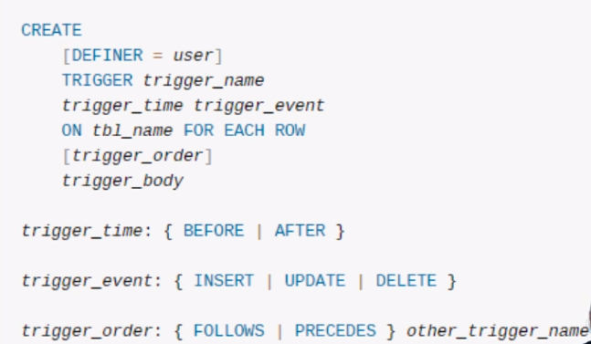
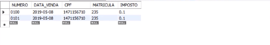
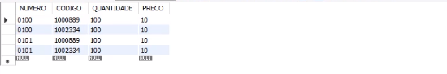
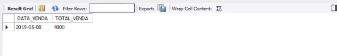
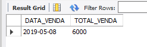
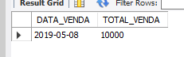
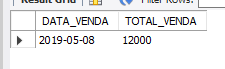

## TRIGGER

A TRIGGER seria um, como o próprio nome em inglês diz, é um gatilho. É uma regra que é disparada no momento em que uma tabela sofre uma modificação nos seus dados, ou seja, uma inclusão, alteração ou exclusão.<br>

#### Sintaxe
<br>

Vamos criar uma tabela auxiliar que irá sempre ter o faturamento consolidado por data da venda. Execute o comando:
```
CREATE TABLE TAB_FATURAMENTO

(DATA_VENDA DATE NULL, TOTAL_VENDA FLOAT);
```
O objetivo é que, a cada inclusão de dados na tabela de NOTAS e ITENS_NOTAS o valor da TAB_FATURAMENTO seja atualizado. <br>
OBS: Cada uma dessas três linhas abaixo correspondem a uma venda, é uma nota fiscal que tem um cabeçalho e dois itens. <br>

Digite e execute:
```
INSERT INTO NOTAS (NUMERO, DATA_VENDA, CPF, MATRICULA, IMPOSTO)

VALUES ('0100', '2019-05-08', '1471156710' , '235', 0.10);

INSERT INTO ITENS_NOTAS (NUMERO, CODIGO, QUANTIDADE, PRECO)

VALUES ('0100', '1000889', 100, 10);

INSERT INTO ITENS_NOTAS (NUMERO, CODIGO, QUANTIDADE, PRECO)

VALUES ('0100', '1002334', 100, 10);
```
```
INSERT INTO NOTAS (NUMERO, DATA_VENDA, CPF, MATRICULA, IMPOSTO)

VALUES ('0101', '2019-05-08', '1471156710' , '235', 0.10);

INSERT INTO ITENS_NOTAS (NUMERO, CODIGO, QUANTIDADE, PRECO)

VALUES ('0101', '1000889', 100, 10);

INSERT INTO ITENS_NOTAS (NUMERO, CODIGO, QUANTIDADE, PRECO)

VALUES ('0101', '1002334', 100, 10);
```

Executando temo duas notas: 
```
SELECT * FROM NOTAS;
```
<br>

E quatro itens:
```
SELECT * FROM ITENS_NOTAS
```
<br>

Para a gente saber o faturamento e a data do faturamento:
```
SELECT A.DATA_VENDA, SUM(B.QUANTIDADE * B.PRECO) AS TOTAL_VENDA FROM

NOTAS A INNER JOIN ITENS_NOTAS B

ON A.NUMERO = B.NUMERO

GROUP BY A.DATA_VENDA;
```
<br>

Insira mais uma venda na tabela:
```
INSERT INTO NOTAS (NUMERO, DATA_VENDA, CPF, MATRICULA, IMPOSTO)

VALUES ('0103', '2019-05-08', '1471156710' , '235', 0.10);

INSERT INTO ITENS_NOTAS (NUMERO, CODIGO, QUANTIDADE, PRECO)

VALUES ('0103', '1000889', 100, 10);

INSERT INTO ITENS_NOTAS (NUMERO, CODIGO, QUANTIDADE, PRECO)

VALUES ('0103', '1002334', 100, 10);
```

Para atualizarmos a tabela TAB_FATURAMENTO temos que executar o comando abaixo. Para isso digite e execute:

```
INSERT INTO TAB_FATURAMENTO

SELECT A.DATA_VENDA, SUM(B.QUANTIDADE * B.PRECO) AS TOTAL_VENDA FROM

NOTAS A INNER JOIN ITENS_NOTAS B

ON A.NUMERO = B.NUMERO

GROUP BY A.DATA_VENDA;
```
```
SELECT * FROM TAB_FATURAMENTO;
```
<br>

Se queremos manter a tabela TAB_FATURAMENTO atualizada temos que repetir sempre o cálculo atual do valor total das vendas sempre que novos registros forem incluídos. Para isso digite e execute:
```
INSERT INTO NOTAS (NUMERO, DATA_VENDA, CPF, MATRICULA, IMPOSTO)

VALUES ('0104', '2019-05-08', '1471156710' , '235', 0.10);

INSERT INTO ITENS_NOTAS (NUMERO, CODIGO, QUANTIDADE, PRECO)

VALUES ('0104', '1000889', 100, 10);

INSERT INTO ITENS_NOTAS (NUMERO, CODIGO, QUANTIDADE, PRECO)

VALUES ('0104', '1002334', 100, 10);
```
```
INSERT INTO NOTAS (NUMERO, DATA_VENDA, CPF, MATRICULA, IMPOSTO)

VALUES ('0105', '2019-05-08', '1471156710' , '235', 0.10);

INSERT INTO ITENS_NOTAS (NUMERO, CODIGO, QUANTIDADE, PRECO)

VALUES ('0105', '1000889', 100, 10);

INSERT INTO ITENS_NOTAS (NUMERO, CODIGO, QUANTIDADE, PRECO)

VALUES ('0105', '1002334', 100, 10);
```
Tem que deletar para depois inserir de novo que senão ele vai repetir os dias:
```
DELETE FROM TAB_FATURAMENTO;
```
```
INSERT INTO TAB_FATURAMENTO

SELECT A.DATA_VENDA, SUM(B.QUANTIDADE * B.PRECO) AS TOTAL_VENDA FROM

NOTAS A INNER JOIN ITENS_NOTAS B

ON A.NUMERO = B.NUMERO

GROUP BY A.DATA_VENDA;
```
```
SELECT * FROM TAB_FATURAMENTO;
```
<br>
Então toda vez que eu rodar uma nota, uma asserção de uma nota eu tenho que apagar a tabela de faturamento e inserir de novo fazendo o cálculo da venda total.A tabela vai aumentando na medida que eu incluo novas vendas.<br><br>

Existe uma maneira automática para fazermos esse processo de atualização das inserções que fazemos e é através de TRIGGERS.<br>
Ou seja, ao inserir um novo item, será atualizado automaticamente a tabela de faturamentos, para toda vez que eu veja a tabela de faturamentos eu possa ver com o valor total já atualizado. <br><br>

Vamos primeiro deletar as tabelas de notas e itens:
```
DELETE FROM NOTAS;
```
```
DELETE FROM ITENS_NOTAS;
```
Então Podemos criar uma TRIGGER para que a tabela TAB_FATURAMENTO seja recalculada sempre que um novo registro for incluído na tabela de ITENS_NOTAS. Para isso digite e execute:
```
DELIMITER //

CREATE TRIGGER TG_CALCULA_FATURAMENTO_INSERT AFTER INSERT ON ITENS_NOTAS
FOR EACH ROW BEGIN

  DELETE FROM TAB_FATURAMENTO;

  INSERT INTO TAB_FATURAMENTO

  SELECT A.DATA_VENDA, SUM(B.QUANTIDADE * B.PRECO) AS TOTAL_VENDA FROM
  NOTAS A INNER JOIN ITENS_NOTAS B
  ON A.NUMERO = B.NUMERO
  GROUP BY A.DATA_VENDA;
END//
```
- AFTER, Eu quero fazer depois de eu incluir o dado, eu não posso fazer antes porque se eu fizer antes de incluir o dado eu não consigo calcular o faturamento, o faturamento só vai poder ser calculado quando o dado estiver inserido na tabela. <br>
- //, Como vamos usar FOR EACH, os comandos dentro dele serão delimitados com ponto e vírgula, são comandos que serão executados separadamente, um delete e depois um insert.
Se colocarmos esse comando DELIMITER// e END// com ponto e virgula,  o MySQL vai pensar que o meu comando TRIGGER acabou no primeiro ponto e virgula que achar. Por isso precisa ser delimitado com as barras // para o mysql compreender onde começa e onde ele tem que terminar a execução.<br><br>

Ao inserir novos registros não é mais preciso executar o cálculo da tabela consolidada. Para isso digite e execute:
```
INSERT INTO NOTAS (NUMERO, DATA_VENDA, CPF, MATRICULA, IMPOSTO)
VALUES ('0106', '2019-05-08', '1471156710' , '235', 0.10);

INSERT INTO ITENS_NOTAS (NUMERO, CODIGO, QUANTIDADE, PRECO)
VALUES ('0106', '1000889', 100, 10);

INSERT INTO ITENS_NOTAS (NUMERO, CODIGO, QUANTIDADE, PRECO)
VALUES ('0106', '1002334', 100, 10);

```
```
SELECT * FROM TAB_FATURAMENTO;
```
<br><br>

