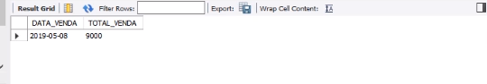
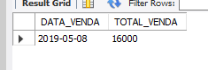

## TRIGGER UPDATE e DELETE

Porém foi criado uma TRIGGER somente para inclusão de registros na tabela. Vamos incluir TRIGGERS para a atualização e exclusão. Para isso digite e execute:
```
DELIMITER //

CREATE TRIGGER TG_CALCULA_FATURAMENTO_UPDATE AFTER UPDATE ON ITENS_NOTAS
FOR EACH ROW BEGIN
  DELETE FROM TAB_FATURAMENTO;

INSERT INTO TAB_FATURAMENTO
  SELECT A.DATA_VENDA, SUM(B.QUANTIDADE * B.PRECO) AS TOTAL_VENDA FROM
  NOTAS A INNER JOIN ITENS_NOTAS B
  ON A.NUMERO = B.NUMERO
  GROUP BY A.DATA_VENDA;
END//
```
```
DELIMITER //

CREATE TRIGGER TG_CALCULA_FATURAMENTO_DELETE AFTER DELETE ON ITENS_NOTAS
FOR EACH ROW BEGIN
  DELETE FROM TAB_FATURAMENTO;

INSERT INTO TAB_FATURAMENTO
  SELECT A.DATA_VENDA, SUM(B.QUANTIDADE * B.PRECO) AS TOTAL_VENDA FROM
  NOTAS A INNER JOIN ITENS_NOTAS B
  ON A.NUMERO = B.NUMERO
  GROUP BY A.DATA_VENDA;
END//
```
Vamos incluir novos registros e verificar a tabela consolidada. Para isso digite e execute:
```
INSERT INTO NOTAS (NUMERO, DATA_VENDA, CPF, MATRICULA, IMPOSTO)
VALUES ('0107', '2019-05-08', '1471156710' , '235', 0.10);

INSERT INTO ITENS_NOTAS (NUMERO, CODIGO, QUANTIDADE, PRECO)
VALUES ('0107', '1000889', 100, 10);

INSERT INTO ITENS_NOTAS (NUMERO, CODIGO, QUANTIDADE, PRECO)
VALUES ('0107', '1002334', 100, 10);
```
```
SELECT * FROM TAB_FATURAMENTO;
```
<br><br>

E alterar/excluir alguns registros. Para isso digite e execute:
```
DELETE FROM ITENS_NOTAS WHERE NUMERO = '0107' AND CODIGO = '1002334';
```
```
UPDATE ITENS_NOTAS SET QUANTIDADE = 400
WHERE NUMERO = '0100' AND CODIGO = '1002334';
```
```
SELECT * FROM TAB_FATURAMENTO;
```
<br><br>

Observação: diferente de alguns outros bancos de dados, eu só posso criar uma trigger para fazer ou insert, ou update, ou delete.
Estamos repetindo código e teoricamente, isso pode ser um procedimento não muito elegante.<br>
Imagina que eu tenha que recalcular a forma com que eu calculo o faturamento: eu vou ter que modificar a trigger de insert, de update e de delete para os mesmos comandos.<br>
Normalmente, não criamos um trigger assim, pegamos esses grupos de comandos e transformamos eles em uma stored procedure.<br>

Uma stored procedure é como se fosse um programa onde eu tenho uma lista de comandos a serem executados. Então a trigger não chama comando, ele executa stored procedure.<br> Posso ter a chamada da stored procedure tanto no insert, quanto no update, quanto no delete. <br>
E no código da stored procedure é que eu coloco a regra de cálculo do faturamento. 
Se a regra mudar, eu mudo somente dentro da stored procedure, não precisando mexer nas triggers.