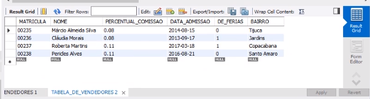
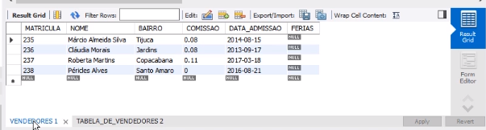
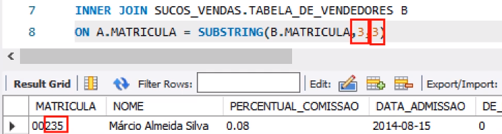
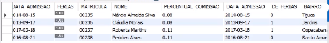
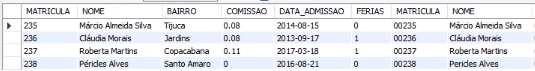
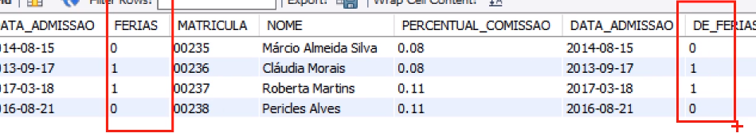

## UPDATE COM FROM

Vamos juntar duas tabelas uma do banco sucos_vendas e outra de vendas_sucos

Esteja na base vendas_sucos
```
USE vendas_sucos;
```
```
SELECT * FROM vendedores;
```

```
SELECT * FROM sucos_vendas.tabela_de_vendedores;
```
Selecione esse dois selects e execute;<br>

Temos tabela_de_vendedores de sucos_vendas:<br>
<br>
E a tabela vendedores de vendas_sucos:<br>
<br>

O que vamos fazer é uma alteração nesse campo de ferias, precisamos pegar as informações do campo DE_FERIAS de sucos_vendas e colocar elas no campo FERIAS da nossa base vendas_sucos.
 - Vamos fazer a junção dessas duas tabelas com INNER JOIN.
 - O campo em comum que ambas as tabelas tem é o de MATRICULA, na tabela de sucos_vendas tem os ZEROS na frente dos numeros, e eles precisam ser tirados na hora que formos fazer essa junção de tabelas, para isso utiliza-se a função SUBSTRING.
 - 3,3: pegando o numero apartir do 2, pegando o 2, 3 e 5<br>
 <br>

Digite e execute:

```
SELECT * FROM VENDEDORES A
INNER JOIN SUCOS_VENDAS.TABELA_DE_VENDEDORES B
ON A.MATRICULA = SUBSTRING(B.MATRICULA,3,3)
```
 <br>

Agora vamos modificar os dados dos campos de ferias, precisamos pegar as informações do campo DE_FERIAS de sucos_vendas e colocar elas no campo FERIAS da nossa base vendas_sucos.

```
UPDATE VENDEDORES A INNER JOIN SUCOS_VENDAS.TABELA_DE_VENDEDORES B
ON A.MATRICULA = SUBSTRING(B.MATRICULA,3,3)
SET A.FERIAS = B.DE_FERIAS;
```
Rode novamente o select:
```
SELECT * FROM VENDEDORES A
INNER JOIN SUCOS_VENDAS.TABELA_DE_VENDEDORES B
ON A.MATRICULA = SUBSTRING(B.MATRICULA,3,3)
```
A junção dos campo com a atualização ficou assim:<br>
<br>
<br>

<br>
Podemos observar que os vendedores possuem bairro associados a eles. Vamos aumentar em 30% o volume de compra dos clientes que possuem, em seus endereços bairros onde os vendedores possuam escritórios.
Digite e execute:

```
SELECT A.CPF FROM CLIENTES A
INNER JOIN VENDEDORES B
ON A.BAIRRO = B.BAIRRO
```
Digite e execute:
```
UPDATE CLIENTES A INNER JOIN VENDEDORES B
ON A.BAIRRO = B.BAIRRO
SET A.VOLUME_COMPRA = A.VOLUME_COMPRA * 1.30
```
<br>
<br>
Então, através de um select pegando dados de uma outra tabela, eu alterei os campos da minha tabela, esse update, rodando ele periodicamente, eu posso fazer essa sincronização.
Foi o que eu fiz aqui. Eu sincronizei o campo férias da minha tabela vendedores com o campo de férias da tabela de vendedores do banco fonte.