## COMMIT e ROLLBACK

Eu posso às vezes apagar uma informação que eu não gostaria de ter apagado, só que existe um mecanismo dentro do MySQL que pode nos dar uma certa segurança caso eu faça uma operação não desejada, é o que a gente chama de uma transação.

Temos executado os comandos sem nos preocuparmos em relação a uma transação. Toda vez que eu dou INSERT um dado é inserido, toda vez que eu dou um UPDATE o dado é alterado, toda vez que eu dou um DELETE o dado é apagado.

Se eu crio uma transação, tudo que eu fizer depois de eu criar a transação vai ficar em memória, a principio não é gravado no banco, porém depois que eu encerrar a transação dependendo da forma como eu encerro a transação, posso fazer as gravações dessas modificações na base de dados ou não.<br><br>

Para iniciar uma transação: START TRANSACTION;<br>
Para finalizar uma transação:COMMIT ou ROLLBACK<br><br>
Diferenças:<br>
COMMIT: Confirmo no banco de dados tudo aquilo que eu modifiquei depois do START TRANSACTION.<br>
ROLLBACK: Se eu der um ROLLBACK eu volto atrás e não consigo ver as modificações, as modificações não são confirmadas no banco.

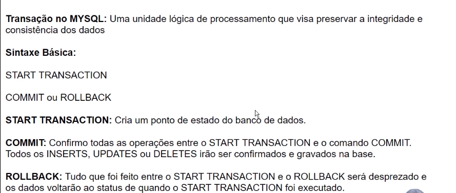<br>

Vamos criar uma transação. Digite e execute o comando abaixo para iniciar uma transação:
```
START TRANSACTION;
```
Vamos verificar a tabela de vendedores:
```
SELECT * FROM VENDEDORES;
```
<br>

Modifique os dados referentes a comissão. Digite e execute:<br>
```
UPDATE VENDEDORES SET COMISSAO = COMISSAO * 1.15;

```
```
SELECT * FROM VENDEDORES;
```
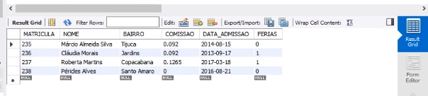<br>
Note que agora o número da comissão ele está em 0.092, 0.092 o segundo, aumentou 15%. O 0.08 foi para 0.92 e o 0.11 foi para 0.1265.<br>

Eu não quero confirmar essa transação, ao dar o ROLLBACK a transação vai ser finalizada, e o que eu fiz será descartado. Vamos refazer o comando acima. Digite e execute:
```
ROLLBACK;
```
```
SELECT * FROM VENDEDORES;
```
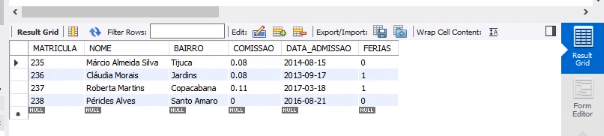<br>
Note que a comissão, voltou ao que estava antes. <br>

Agora vamos fazer o contrário, eu vou dar meu START TRANSACTION, iniciei uma nova transação, dei o meu UPDATE e vou dar aqui o meu SELECT. Digite e execute:

```
START TRANSACTION;
```
```
UPDATE VENDEDORES SET COMISSAO = COMISSAO * 1.15;
```
```
SELECT * FROM VENDEDORES;
```
<br>
Está lá de novo a comissão 15%.<br><br>

Só que agora em vez de dar um ROLLBACK eu vou dar um COMMIT, ou seja, eu vou confirmar essa alteração. Ao dar o COMMIT se eu der o SELECT de novo agora ficou gravada na base o aumento da comissão em 15%.<br>

Vamos confirmar a inclusão destes dados. Para isso digite:
```
COMMIT;
```
```
SELECT * FROM VENDEDORES;
```
<br>
<br>
Isso vale também para o INSERT.

```
START TRANSACTION;
```
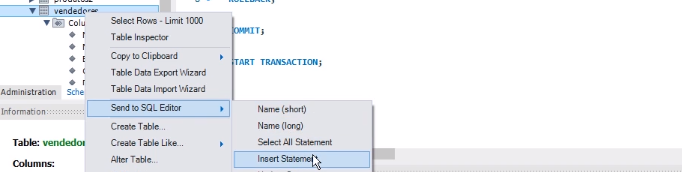<br>
Ele nos formece os dados:<br>
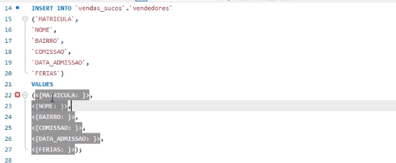<br>
Vamos modificar os VALUES:<br>
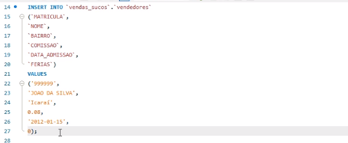<br>

```
SELECT * FROM VENDEDORES;
```
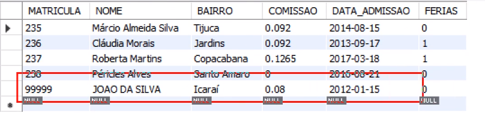<br>
Vamos fazer um update na comissão:

```
UPDATE VENDEDORES SET COMISSAO = COMISSAO * 1.15;
```
```
SELECT * FROM VENDEDORES;
```
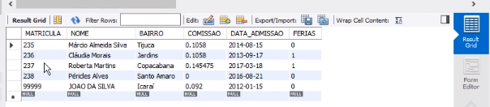<br>

Insira mais um vendedor:<br>
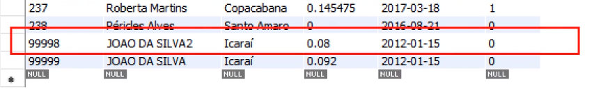<br>

Após esses nossos inserts e update, vamos dar o ROLLBACK:
```
ROLLBACK;
```
```
SELECT * FROM VENDEDORES;
```
Veja que retornamos a tabela original:<br>
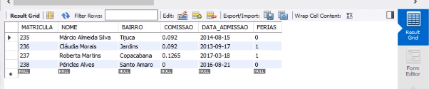<br>

Novamente:
```
START TRANSACTION;
```
Insira os dois INSERTS e o UPDATE e execute-os novamente.<br>
```
INSERT INTO `vendas_sucos`,`vendedores`
(`MATRICULA`,`NOME`, `BAIRO`, `COMISSAO`, `DATA_ADMISSAO`, `FERIAS`)
VALUES
('99999', 'JOAO DA SILVA', 'ICARAI', 0.08, '2012-01-15, 0),
('99998', 'JOAO DA SILVA2', 'ICARAI', 0.08, '2012-01-15, 0);
```
```
UPDATE VENDEDORES SET COMISSAO = COMISSAO * 1.15;
```

Dando o select voltamos a ter a tabela com as modificações:
```
SELECT * FROM VENDEDORES;
```
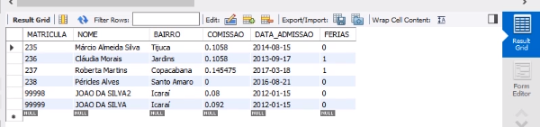<br>

E dando um COMMIT, vamos confirmar essas modificações dentro da nossa base de dados:
```
COMMIT;
```