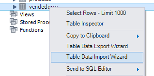
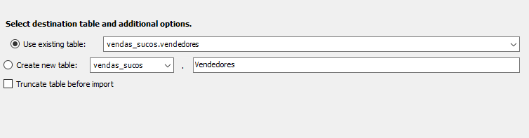
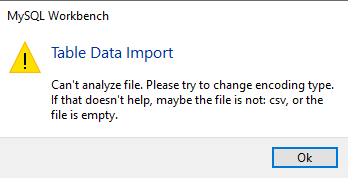
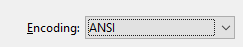
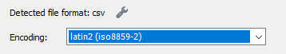
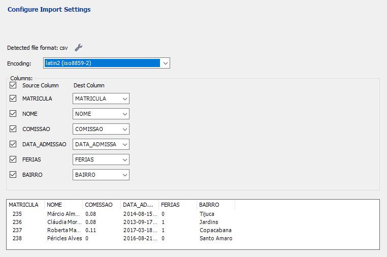
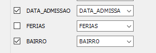
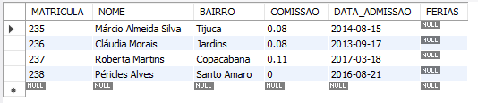

# Usando importação de dados de arquivos externos

1. Descompacte o arquivos.zip contido na pasta arquivos.
2. Botão da direita do mouse sobre a tabela Vendedores e escolha a opção Table Data Import Wizard.
<br>
3. Em File Path selecione o arquivo Vendedores.csv.
4. Mantenha os dados padrões como mostrado abaixo:
<br>
5.Observação: Se você visualizar um erro como mostrado abaixo:
<br>
Há erro na interpretação da tabela através da lista de caracteres. Para isso faça:
- Abra o arquivo com Notepad clássico;
- Clique arquivo / Salvar como.
- Escolha o padrão ANSI:<br>
<br>
Volte a caixa de diálogo e escolha:<br>
<br>
Pode existir problemas entre computadores e entre os arquivos baixados. Você deve ver a combinação correta entre o formato do arquivo (Que pode ser modificado no NOTEPAD clássico) e na caixa de diálogo de importação de dados.<br>
<br>
5. Desmarque a opção FERIAS:<br>
<br>
6.Clique em Next várias vezes até os dados serem incluídos na tabela de vendedores.<br>
7.Verifique o conteúdo da tabela de vendedores.

```
SELECT * FROM VENDEDORES;
```
<br>
